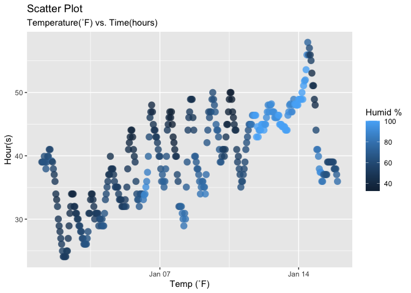

HW 1
================
Disheng jiang

# Problem 1

## 1st Step

Loading library that going to used in the rest of problems

``` r
library(moderndive) # provide data "early_january_weather"
library(tidyverse) # dplyr/ggplot2/readr
```

    ## ── Attaching core tidyverse packages ──────────────────────── tidyverse 2.0.0 ──
    ## ✔ dplyr     1.1.4     ✔ readr     2.1.5
    ## ✔ forcats   1.0.0     ✔ stringr   1.5.1
    ## ✔ ggplot2   4.0.0     ✔ tibble    3.3.0
    ## ✔ lubridate 1.9.4     ✔ tidyr     1.3.1
    ## ✔ purrr     1.1.0     
    ## ── Conflicts ────────────────────────────────────────── tidyverse_conflicts() ──
    ## ✖ dplyr::filter() masks stats::filter()
    ## ✖ dplyr::lag()    masks stats::lag()
    ## ℹ Use the conflicted package (<http://conflicted.r-lib.org/>) to force all conflicts to become errors

Creating a dataset from moderndive library

``` r
data("early_january_weather")
```

## 2nd Step

Check all the variable names

``` r
names(early_january_weather)
```

    ##  [1] "origin"     "year"       "month"      "day"        "hour"      
    ##  [6] "temp"       "dewp"       "humid"      "wind_dir"   "wind_speed"
    ## [11] "wind_gust"  "precip"     "pressure"   "visib"      "time_hour"

Check the column and row numbers (how many)

``` r
nrow(early_january_weather)
```

    ## [1] 358

``` r
ncol(early_january_weather)
```

    ## [1] 15

Calculate the mean of temperature

``` r
mean(early_january_weather[["temp"]], na.rm = TRUE)
```

    ## [1] 39.58212

## Alternative way to get all the information above

``` r
library(skimr)
skim(early_january_weather)
```

|                                                  |                       |
|:-------------------------------------------------|:----------------------|
| Name                                             | early_january_weather |
| Number of rows                                   | 358                   |
| Number of columns                                | 15                    |
| \_\_\_\_\_\_\_\_\_\_\_\_\_\_\_\_\_\_\_\_\_\_\_   |                       |
| Column type frequency:                           |                       |
| character                                        | 1                     |
| numeric                                          | 13                    |
| POSIXct                                          | 1                     |
| \_\_\_\_\_\_\_\_\_\_\_\_\_\_\_\_\_\_\_\_\_\_\_\_ |                       |
| Group variables                                  | None                  |

Data summary

**Variable type: character**

| skim_variable | n_missing | complete_rate | min | max | empty | n_unique | whitespace |
|:--------------|----------:|--------------:|----:|----:|------:|---------:|-----------:|
| origin        |         0 |             1 |   3 |   3 |     0 |        1 |          0 |

**Variable type: numeric**

| skim_variable | n_missing | complete_rate | mean | sd | p0 | p25 | p50 | p75 | p100 | hist |
|:---|---:|---:|---:|---:|---:|---:|---:|---:|---:|:---|
| year | 0 | 1.00 | 2013.00 | 0.00 | 2013.00 | 2013.00 | 2013.00 | 2013.00 | 2013.00 | ▁▁▇▁▁ |
| month | 0 | 1.00 | 1.00 | 0.00 | 1.00 | 1.00 | 1.00 | 1.00 | 1.00 | ▁▁▇▁▁ |
| day | 0 | 1.00 | 8.04 | 4.31 | 1.00 | 4.00 | 8.00 | 12.00 | 15.00 | ▇▇▇▇▇ |
| hour | 0 | 1.00 | 11.53 | 6.92 | 0.00 | 6.00 | 11.50 | 17.75 | 23.00 | ▇▇▆▇▇ |
| temp | 0 | 1.00 | 39.58 | 7.06 | 24.08 | 33.98 | 39.02 | 44.96 | 57.92 | ▃▇▇▇▁ |
| dewp | 0 | 1.00 | 28.06 | 10.73 | 8.96 | 19.94 | 26.06 | 35.06 | 53.06 | ▃▇▆▂▃ |
| humid | 0 | 1.00 | 65.48 | 18.95 | 32.86 | 51.34 | 61.67 | 78.68 | 100.00 | ▃▇▆▂▅ |
| wind_dir | 5 | 0.99 | 208.19 | 115.58 | 0.00 | 140.00 | 240.00 | 290.00 | 360.00 | ▅▁▂▇▆ |
| wind_speed | 0 | 1.00 | 8.23 | 4.61 | 0.00 | 5.75 | 8.06 | 11.51 | 24.17 | ▅▇▆▂▁ |
| wind_gust | 308 | 0.14 | 22.53 | 3.63 | 16.11 | 19.56 | 21.86 | 25.32 | 31.07 | ▅▇▃▇▁ |
| precip | 0 | 1.00 | 0.00 | 0.01 | 0.00 | 0.00 | 0.00 | 0.00 | 0.19 | ▇▁▁▁▁ |
| pressure | 38 | 0.89 | 1022.52 | 5.57 | 1010.80 | 1018.30 | 1022.05 | 1027.23 | 1034.40 | ▃▇▇▇▃ |
| visib | 0 | 1.00 | 8.52 | 3.00 | 0.12 | 9.00 | 10.00 | 10.00 | 10.00 | ▁▁▁▁▇ |

**Variable type: POSIXct**

| skim_variable | n_missing | complete_rate | min | max | median | n_unique |
|:---|---:|---:|:---|:---|:---|---:|
| time_hour | 0 | 1 | 2013-01-01 01:00:00 | 2013-01-15 23:00:00 | 2013-01-08 12:30:00 | 358 |

## Conclusion

1.  Variables: origin, year, month, day, hour, temp(˚F), dewp(˚F),
    humid(%), wind_dir(˚), wind_speed(mph), wind_gust(mph),
    precip(inches), pressure(mbar), visib(miles), time_hour (total 15
    variables).
2.  358 rows and 15 columns.
3.  About average 39.58˚F.
4.  Scatter plot is in 3rd step

## 3rd Step

Visualize the time and temperature by scatter plot and save it

``` r
ggplot(early_january_weather, aes ( x = time_hour ,  y = temp , color = humid )) +
  geom_point(size = 4, alpha = 0.8, stroke = 0.05,) +
  labs(title = "Scatter Plot",
       subtitle = "Temperature(˚F) vs. Time(hours)",
       x = "Temp (˚F)",
       y = "Hour(s)",
       color = "Humid %"
       ) 
```

<!-- -->

``` r
ggsave("scatter_plot.png", dpi = 600, path = "~/Desktop/💻/按课程类型分类/P8105 Data Science 1/Homeworks/p8105_hw1")
```

    ## Saving 7 x 5 in image

# Problem 2

## 1st Step

Create a dataframe

``` r
data_df = tibble(
  norm_sample = rnorm(10), # A random sample of size 10 from a standard Normal distribution
  
  vec_logical = rnorm(10) > 0, # A logical vector indicating whether elements of the sample are       greater than 0
  
  vec_char = letters[1:10], # A character vector of length 10
  
  vec_factor = factor(rep(c("Super", "Modest", "Inferior"), length.out = 10)) # A factor vector of length 10, with 3   different factor “levels”
)
```

## Q2: Try to take the mean of each variable in your dataframe. What works and what doesn’t?

Taking the mean of a variable in a dataframe by using the pull function

``` r
mean(data_df |>  pull(norm_sample)) # Value is working
```

    ## [1] -0.05780696

``` r
mean(data_df |>  pull(vec_logical)) # Logical is working
```

    ## [1] 0.3

``` r
mean(data_df |>  pull(vec_char)) # Character is not working
```

    ## Warning in mean.default(pull(data_df, vec_char)): argument is not numeric or
    ## logical: returning NA

    ## [1] NA

``` r
mean(data_df |>  pull(vec_factor)) # Factor is not working
```

    ## Warning in mean.default(pull(data_df, vec_factor)): argument is not numeric or
    ## logical: returning NA

    ## [1] NA

Conclusion: Only numerical value is working with mean and pull function

## Q3: What happens, and why?

Applying the as.numeric function to the logical, character, and factor
variables

``` r
as.numeric(data_df |>  pull(vec_logical)) # Logical is working
```

    ##  [1] 0 0 1 0 0 0 0 1 1 0

``` r
as.numeric(data_df |>  pull(vec_char)) # Character is not working (NA returns)
```

    ## Warning: NAs introduced by coercion

    ##  [1] NA NA NA NA NA NA NA NA NA NA

``` r
as.numeric(data_df |>  pull(vec_factor)) # Factor is partially working (return internal encoding)
```

    ##  [1] 3 2 1 3 2 1 3 2 1 3

Conclusion:

Logical: 1=TRUE, 0=FALSE.

Character: Reports an error message stating “NAs introduced by coercion”
because character values cannot be directly converted to numeric values.

Factor: Returns the internal encoding of the factor (1 and 2), not the
actual names of the levels.

## Q3 (continue):Does this help explain what happens when you try to take the mean?

A:Yes, for numeric columns, mean is the regular mean. But for logical
columns, R automatically interpret TRUE as 1 and FALSE as 0, so the
average is calculated. If the value is more close to 1, the TUREs are
more. And for character columns, mean reports an error because it cannot
convert to numeric values. Last for factor columns, mean reports an
error because factors are categorical and are not automatically
converted to coded numeric values.

## Summary

The mean function is only works on numeric and logical data
types.Character and factor values it won’t automatically converted to
numeric values. When we applied the mean function, it will return an
error message. The as.numeric function reveals how R handles different
data types internally.
